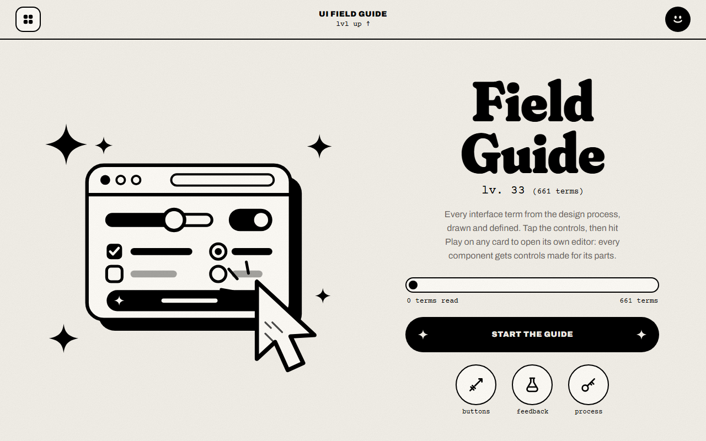
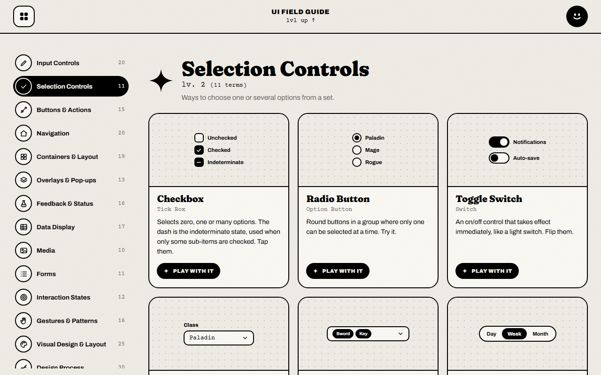
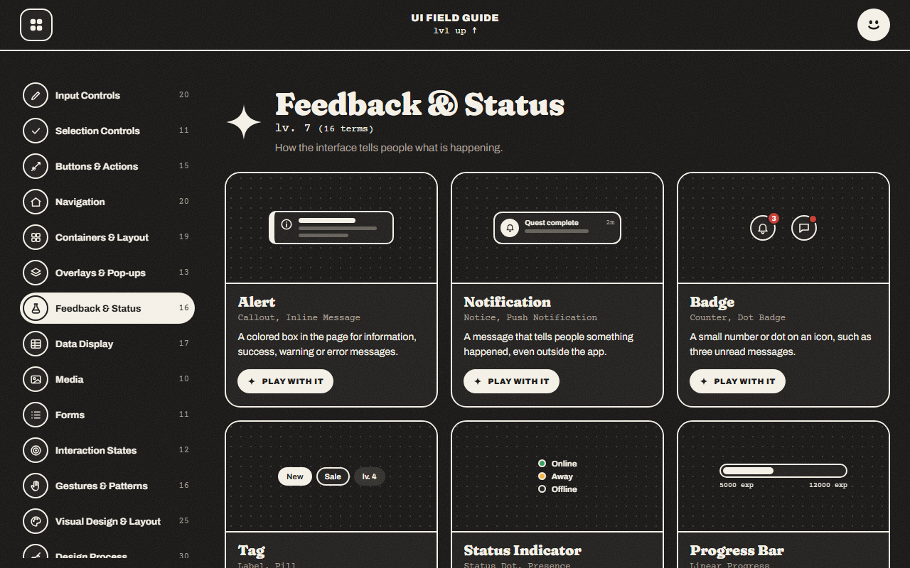
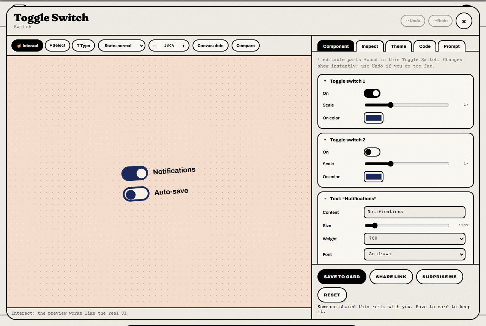
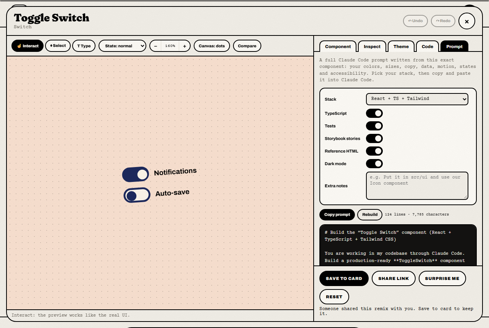
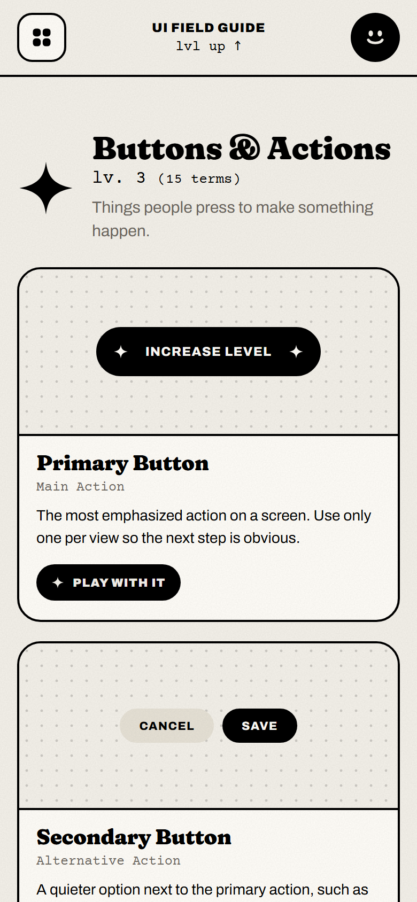

# UI Field Guide

**[Open the live site →](https://harry-verdeflor.github.io/ui-field-guide/)**

A visual glossary of 661 UI/UX terms in 33 categories. Every term is a card with a live, hand-drawn demo. Hit **Play with it** on any card to open a playground where you can restyle and edit that component, then generate a Claude Code prompt to build it for real.



## Screenshots

**Every term is a card with a working demo.** Tick the checkboxes, flip the switches, open the dropdowns.



**Dark mode** follows your system setting, or switch it with the smiley button.



**The playground** gives each component its own editor: colors, sizes, text, states, zoom and a compare view. Save it to the card or share it as a link.



**The Prompt tab** turns your exact version into a full Claude Code prompt for your stack.



<p align="center"></p>
<p align="center"><em>Works on phones too.</em></p>

## Features

- **Live demos** for every term, in light and dark mode.
- **Playground** for each component: theme knobs, per-part editors, inspect, code view, undo/redo, state simulation and a side-by-side compare with the original.
- **Prompt builder** that writes a full Claude Code prompt for your stack (React, Next.js, Vue, Svelte, SwiftUI, Compose, Flutter or plain HTML).
- **Share links.** *Share link* in the playground copies a URL with your remix compressed into it. Whoever opens it sees your version. Nothing is uploaded anywhere.
- **Term links.** `#t=toggle-switch` jumps to that card.
- **Back up / restore** your saved remixes as a JSON file (in the footer), so you can move them to another browser.
- Press `/` to search.

## How it's built

It's a static site: plain HTML, CSS and JavaScript. No build step, no dependencies, no server code.

```
index.html        markup
css/style.css     all styles (light + dark)
js/helpers.js     icons and drawing helpers
js/terms.js       the 661 terms and their demos
js/app.js         rendering, playground, prompt builder, share links
docs/screenshots  images for this README
```

## Run it locally

Serve the folder over HTTP (opening `index.html` from disk works too, but share links, the clipboard and "Copy as full page" need a server):

```bash
python -m http.server 8000
```

Then open http://localhost:8000.

## Deploy

It's hosted on GitHub Pages from the `main` branch, so every push to `main` updates the live site within a minute or two. Any other static host (Cloudflare Pages, Netlify, surge) works the same way: upload the folder as is.

## Working on it

Open this folder in Claude Code. It reads `CLAUDE.md` for the file map, conventions and the checks to run before finishing a change.
